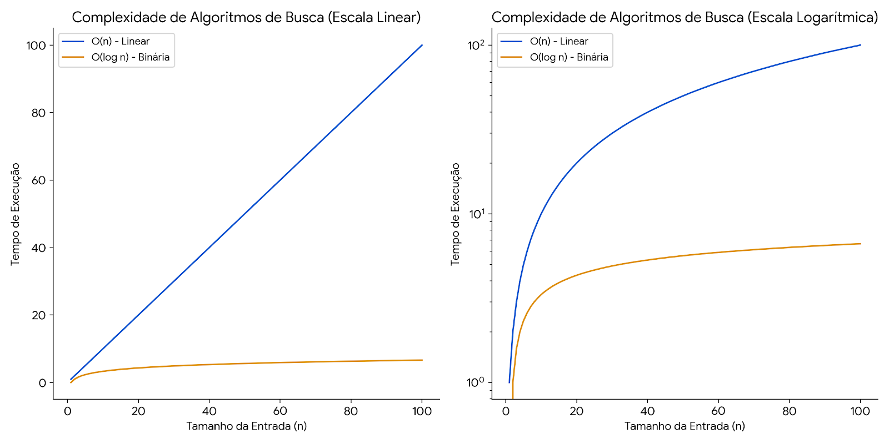

# Análises de Complexidade

## 1. Busca Linear

- **Pior Caso:** A chave está no último elemento ou não está presente no array.
- **Tempo de Execução:** O loop `for` itera `n` vezes no pior caso.
- **Função Algébrica:** `T(n) = n`
- **Notação Big O:** `O(n)` - Complexidade linear

## 2. Busca Linear em Ordem (Array Ordenado)

- **Pior Caso:** A chave é maior que todos os elementos do array ou não está presente.
- **Tempo de Execução:** O loop `for` itera no máximo `n` vezes.
- **Função Algébrica:** `T(n) = n`
- **Notação Big O:** `O(n)` - Embora possa terminar antes em alguns casos, o pior caso ainda é linear.

## 3. Busca Binária (Array Ordenado)

- **Pior Caso:** A chave não está presente no array, e o intervalo de busca é dividido ao meio repetidamente até que reste apenas um elemento.
- **Tempo de Execução:** O loop `while` reduz o intervalo de busca pela metade a cada iteração. No pior caso, o número de iterações é `log₂(n)`.
- **Função Algébrica:** `T(n) = log₂(n)`
- **Notação Big O:** `O(log n)` - Complexidade logarítmica

## Gráficos produzidos:

### Os gráficos acima ilustram a complexidade de tempo dos algoritmos de busca.

- Escala Linear: Na escala linear, a diferença entre a busca linear (O(n)) e a busca binária (O(log n)) é evidente. A busca linear cresce de forma constante com o tamanho da entrada, enquanto a busca binária cresce muito mais lentamente.

- Escala Logarítmica: Na escala logarítmica, a busca binária se torna uma linha quase reta, demonstrando seu crescimento logarítmico. Isso reforça que a busca binária é significativamente mais eficiente para grandes entradas em comparação com a busca linear, cujo crescimento continua exponencial mesmo na escala logarítmica.